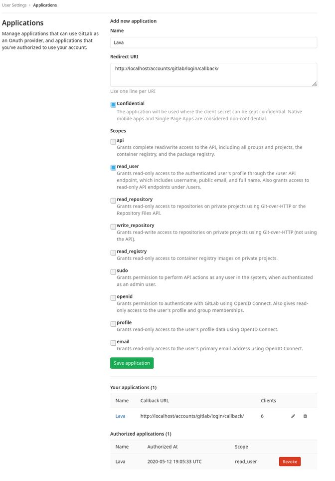
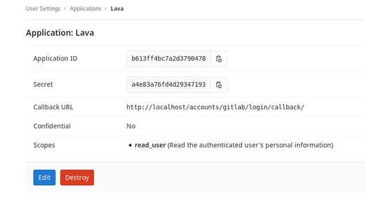
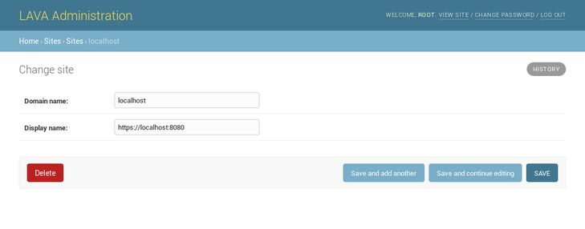
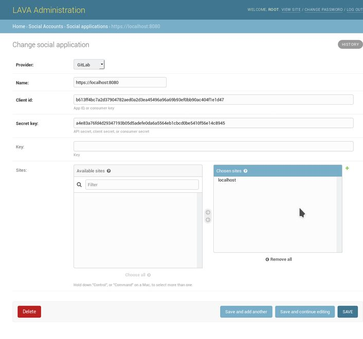
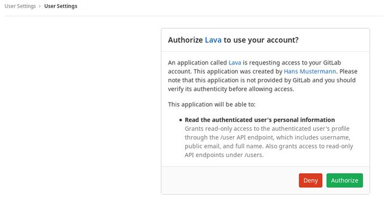

.. index:: user authentication

.. _user_authentication:

Configuring user authentication
===============================

The LAVA frontend is developed using the Django_ web application framework and
user authentication and authorization is based on the standard `Django auth
subsystems`_. This means that it is fairly easy to integrate authentication
against any source for which a Django backend exists. Discussed below are the
tested and supported authentication methods for LAVA.

.. _Django: https://www.djangoproject.com/
.. _`Django auth subsystems`: https://docs.djangoproject.com/en/dev/topics/auth/

.. note:: LAVA used to include support for OpenID authentication (prior to
   version 2016.8), but this support had to be **removed** when incompatible
   changes in Django (version 1.8) caused it to break. The new openid support for Gitlab is introuduced using `Django Allauth`_ plugin.

.. _`Django Allauth`: https://django-allauth.readthedocs.io/en/latest/overview.html

Local Django user accounts are supported. When using local Django user
accounts, new user accounts need to be created by Django admin prior to use.

.. seealso:: :ref:`admin_adding_users`

Using Gitlab for authentication
--------------------------------------------------

LAVA server may be configured to authenticate via Gitlab. Lava uses python-django-allauth
as a backend for  Gitlab authentication.

Gitlab server support is enabled and configured using the following parameters in
``/etc/lava-server/settings.conf`` (JSON syntax)::

"AUTH_GITLAB_SERVER_URI": "https://gitlab.example.com",

These settings need to be configured in the GUI:

The new application for the LAVA authentication needs to be registered, the callback URL is needed to be set-up, with permission read_user.

The information ID, secret and callnack URL need to be copied to the social application set.

The Gitlab site with SITE_ID needs to be edited.

Social application needs to be set-up with social application data.

After the login, to the gitlab the new user needs to authorize the application.

.. _ldap_authentication:

Using Lightweight Directory Access Protocol (LDAP)
--------------------------------------------------

LAVA server may be configured to authenticate via Lightweight
Directory Access Protocol (LDAP). LAVA uses the `django_auth_ldap`_
backend for LDAP authentication.

.. _`django_auth_ldap`: https://django-auth-ldap.readthedocs.io/en/latest/

LDAP server support is configured using the following parameters in
``/etc/lava-server/settings.conf`` (JSON syntax)::

  "AUTH_LDAP_SERVER_URI": "ldap://ldap.example.com",
  "AUTH_LDAP_BIND_DN": "",
  "AUTH_LDAP_BIND_PASSWORD": "",
  "AUTH_LDAP_USER_DN_TEMPLATE": "uid=%(user)s,ou=users,dc=example,dc=com",
  "AUTH_LDAP_USER_ATTR_MAP": {
    "first_name": "givenName",
    "email": "mail"
  },

Use the following parameter to configure a custom LDAP login page
message::

    "LOGIN_MESSAGE_LDAP": "If your Linaro email is first.second@linaro.org then use first.second as your username"

Other supported parameters are::

  "AUTH_LDAP_GROUP_SEARCH": "LDAPSearch('ou=groups,dc=example,dc=com', ldap.SCOPE_SUBTREE, '(objectClass=groupOfNames)'",
  "AUTH_LDAP_USER_FLAGS_BY_GROUP": {
    "is_active": "cn=active,ou=django,ou=groups,dc=example,dc=com",
    "is_staff": "cn=staff,ou=django,ou=groups,dc=example,dc=com",
    "is_superuser": "cn=superuser,ou=django,ou=groups,dc=example,dc=com"
  }

Similarly::

  "AUTH_LDAP_USER_SEARCH": "LDAPSearch('o=base', ldap.SCOPE_SUBTREE, '(uid=%(user)s)')"

.. note:: If you need to make deeper changes that don't fit into the
          exposed configuration, it is quite simple to tweak things in
          the code here. Edit
          ``/usr/lib/python3/dist-packages/lava_server/settings/common.py``

Restart the ``lava-server`` and ``apache2`` services after any
changes.
